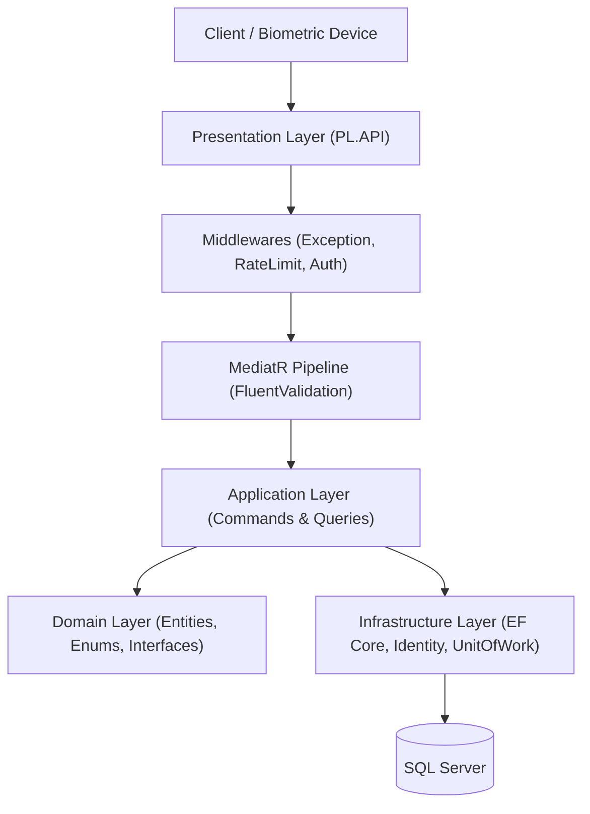
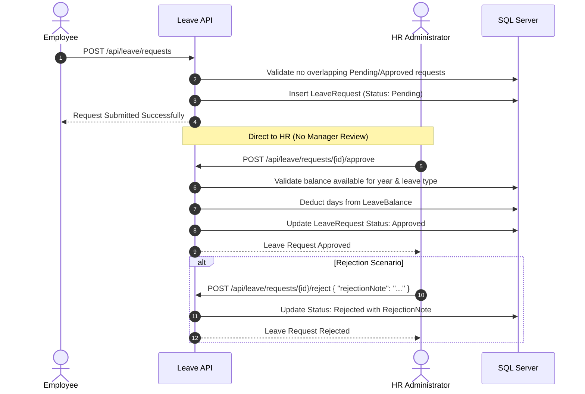
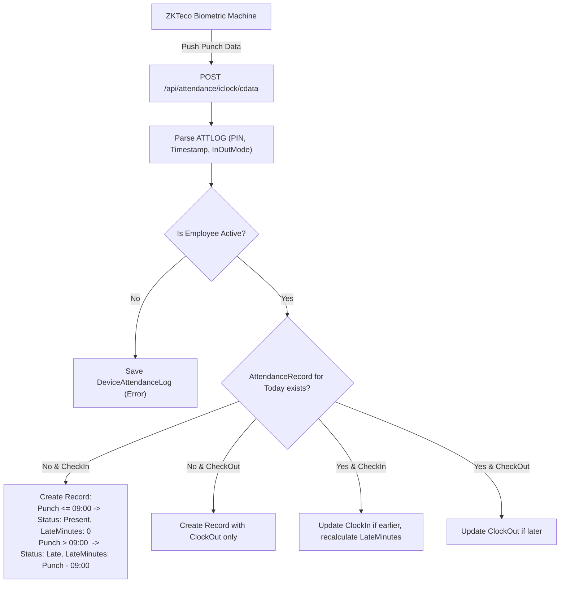
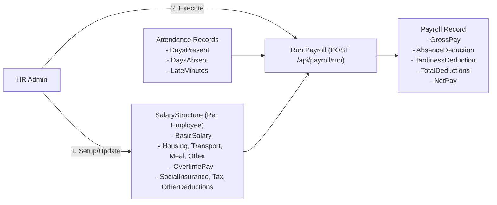
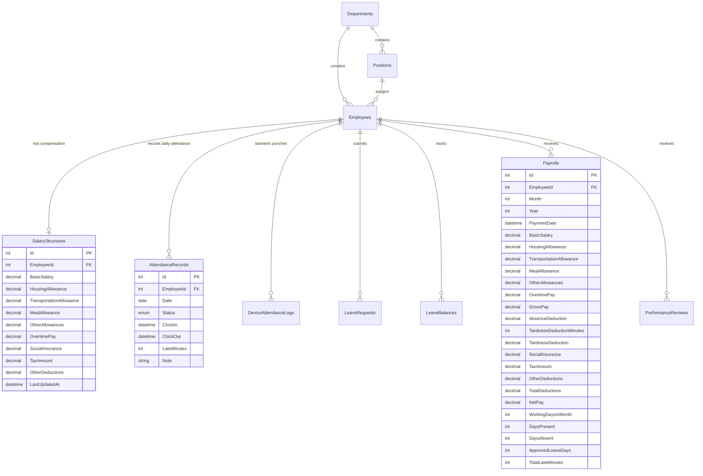

# 🏢 HR Management System — Complete System & Business Documentation

Comprehensive documentation covering architecture, business workflows, database schemas, and API references for the HR Management System.

---

## 📑 Table of Contents
1. [Architecture Overview](#1-architecture-overview)
2. [User Roles & Security Model](#2-user-roles--security-model)
3. [Core Business Workflows](#3-core-business-workflows)
   - [3.1 Leave Workflow (Direct-to-HR)](#31-leave-workflow-direct-to-hr)
   - [3.2 Attendance & Biometric Tracking](#32-attendance--biometric-tracking)
   - [3.3 60-Minute Monthly Tardiness Allowance](#33-60-minute-monthly-tardiness-allowance)
   - [3.4 Customizable Salary Structures & Automated Payroll](#34-customizable-salary-structures--automated-payroll)
   - [3.5 Performance Reviews & Organization Hierarchy](#35-performance-reviews--organization-hierarchy)
4. [Database Entities & Relationships](#4-database-entities--relationships)
5. [Complete API Reference](#5-complete-api-reference)
6. [Deployment & Database Migrations](#6-deployment--database-migrations)

---

## 1. Architecture Overview

The system is built on **Clean Architecture** and **CQRS (Command Query Responsibility Segregation)** principles using **ASP.NET Core 8.0**:



### Key Technical Pillars
* **API Framework**: ASP.NET Core 8 Web API
* **Design Patterns**: CQRS with MediatR, Repository Pattern with `IUnitOfWork`
* **Data Access**: Entity Framework Core 8 with Code-First migrations
* **Validation**: FluentValidation automatic pipeline behavior
* **Authentication**: JWT Bearer Tokens with ASP.NET Core Identity
* **Biometric Ingestion**: ZKTeco push protocol listener (`/api/attendance/iclock`)
* **Logging & Observability**: Serilog with rolling file sinks, Health Checks at `/health`

---

## 2. User Roles & Security Model

The system implements Role-Based Access Control (RBAC) via ASP.NET Core Identity:

| Role | Target | Capabilities |
| :--- | :--- | :--- |
| **HR** (`AdminOnly`) | Management / Administrative Staff | Complete control over employees, salary configurations, payroll processing, leaves approval/rejection, manual attendance overrides, and reviews. |
| **Employee** | Regular Personnel | View personal attendance, submit leave requests, view monthly payslips, acknowledge performance reviews, and securely change passwords. |

### Password Management Workflow
* Any authenticated user can change their own password via `POST /api/auth/change-password`.
* **Security Guard**: The `UserId` is extracted directly from the authenticated JWT token claim (`ClaimTypes.NameIdentifier`). A client cannot change passwords on behalf of other users.
* Requires valid current password and enforces a minimum length of 6 characters with mandatory difference from the current password.

---

## 3. Core Business Workflows

### 3.1 Leave Workflow (Direct-to-HR)



* **Elimination of Manager Layer**: Employees directly submit requests to HR.
* **Overlapping Guard**: Prevents an employee from submitting requests that conflict with existing approved or pending leaves.
* **Balance Enforcement**: For paid leaves (`Annual`, `Sick`, etc.), the system verifies sufficient remaining days in `LeaveBalance` before approval and auto-deducts upon approval. `Unpaid` leaves bypass balance deduction.

---

### 3.2 Attendance & Biometric Tracking

All daily attendance records are driven **exclusively through Biometric Fingerprint/Face Devices** (ZKTeco protocol). Manual employee clock-in/out endpoints have been decommissioned.



* **Official Start Time**: `09:00 AM`.
* **Late Calculation**: Punches after `09:00 AM` automatically mark status as `AttendanceStatus.Late` and record `LateMinutes = (PunchTime - 09:00 AM)`.
* **Audit Trail**: Every raw punch is archived in `DeviceAttendanceLogs` with processing status and timestamps.

---

### 3.3 60-Minute Monthly Tardiness Allowance

Every employee is entitled to a **60-minute free tardiness allowance per calendar month**:

$$\text{DeductibleMinutes} = \max(0, \text{TotalLateMinutes} - 60)$$

* **Monthly Tardiness Summary Query**: HR can inspect monthly tardiness metrics at any time via `GET /api/attendance/tardiness/{employeeId}?year={y}&month={m}`.
* Returns total occurrences, accumulated tardiness minutes, allowed grace minutes (60), and net deductible minutes.

---

### 3.4 Customizable Salary Structures & Automated Payroll

The compensation engine separates **salary configuration** from **monthly payroll execution**.



#### 1. Salary Structure (`SalaryStructure`)
HR customizes compensation items for any employee at `POST /api/payroll/salary-structure/{employeeId}`:
* **Earnings**: Basic Salary, Housing Allowance, Transportation Allowance, Meal Allowance, Other Allowances, Overtime Pay.
* **Fixed Deductions**: Social Insurance, Tax Amount, Other Deductions.

#### 2. Automatic Calculations During Monthly Run (`POST /api/payroll/run`)
* **Gross Pay**:
  $$\text{GrossPay} = \text{Basic} + \text{Housing} + \text{Transportation} + \text{Meal} + \text{OtherAllowances} + \text{OvertimePay}$$
* **Absence Deduction**:
  $$\text{DailyRate} = \frac{\text{BasicSalary}}{\text{WorkingDaysInMonth}}$$
  $$\text{AbsenceDeduction} = \text{DailyRate} \times \text{DaysAbsent}$$
* **Tardiness Deduction** (Integrating Biometric Hours):
  $$\text{PerMinuteRate} = \frac{\text{BasicSalary}}{\text{WorkingDaysInMonth} \times 8 \times 60}$$
  $$\text{TardinessDeduction} = \text{PerMinuteRate} \times \max(0, \text{TotalLateMinutes} - 60)$$
* **Total Deductions**:
  $$\text{TotalDeductions} = \text{AbsenceDeduction} + \text{TardinessDeduction} + \text{SocialInsurance} + \text{TaxAmount} + \text{OtherDeductions}$$
* **Net Pay**:
  $$\text{NetPay} = \text{GrossPay} - \text{TotalDeductions}$$

#### 3. Post-Run Corrections (`PUT /api/payroll/{id}`)
HR can override `OvertimePay` or `OtherDeductions` on an existing payroll slip. The system automatically recalculates `GrossPay`, `TotalDeductions`, and `NetPay`.

---

### 3.5 Performance Reviews & Organization Hierarchy
* HR creates reviews (`POST /api/performancereview`) with ratings (1–5) and written feedback.
* Employees view and acknowledge their reviews (`POST /api/performancereview/{id}/acknowledge`).
* Organization hierarchy supports Departments, Positions with base salaries, and optional Manager references.

---

## 4. Database Entities & Relationships



---

## 5. Complete API Reference

### 🔐 Authentication (`/api/auth`)
| Method | Endpoint | Authorization | Description |
| :--- | :--- | :--- | :--- |
| `POST` | `/api/auth/login` | Public | Authenticates user; returns JWT token. |
| `POST` | `/api/auth/register` | `HR` (AdminOnly) | Registers a new user account (HR or Employee). |
| `POST` | `/api/auth/change-password` | Authenticated | Changes password for the currently logged-in user. |

### 📅 Leaves (`/api/leave`)
| Method | Endpoint | Authorization | Description |
| :--- | :--- | :--- | :--- |
| `POST` | `/api/leave/requests` | Authenticated | Submits a leave request directly to HR. |
| `POST` | `/api/leave/requests/{id}/approve` | `HR` (AdminOnly) | Approves request & deducts balance. |
| `POST` | `/api/leave/requests/{id}/reject` | `HR` (AdminOnly) | Rejects request with optional note. |
| `DELETE`| `/api/leave/requests/{id}?employeeId=X` | Authenticated | Cancels a pending request. |
| `GET` | `/api/leave/requests/employee/{employeeId}` | Authenticated | Retrieves employee leave history. |
| `GET` | `/api/leave/requests` | `HR` (AdminOnly) | Queries leave requests across company/departments. |
| `GET` | `/api/leave/balances/{employeeId}` | Authenticated | Retrieves annual leave balances. |
| `POST` | `/api/leave/balances` | `HR` (AdminOnly) | Sets annual quota for a leave type. |

### ⏰ Attendance (`/api/attendance`)
| Method | Endpoint | Authorization | Description |
| :--- | :--- | :--- | :--- |
| `POST` | `/api/attendance/iclock/cdata` | Public / Device | Receives ZKTeco push punches. |
| `GET` | `/api/attendance/tardiness/{employeeId}` | `HR` (AdminOnly) | Retrieves monthly tardiness breakdown & deductible minutes. |
| `GET` | `/api/attendance/employee/{employeeId}` | Authenticated | Paginated attendance records for employee. |
| `GET` | `/api/attendance/department/{deptId}/date/{d}` | Authenticated | Department attendance on a specific date. |
| `POST` | `/api/attendance` | `HR` (AdminOnly) | Manually creates an attendance record. |
| `PUT` | `/api/attendance/{id}` | `HR` (AdminOnly) | Modifies/corrects an attendance record. |
| `DELETE`| `/api/attendance/{id}` | `HR` (AdminOnly) | Deletes an attendance record. |
| `GET` | `/api/attendance/device-logs` | `HR` (AdminOnly) | Inspects raw biometric punch log history. |

### 💰 Payroll (`/api/payroll`)
| Method | Endpoint | Authorization | Description |
| :--- | :--- | :--- | :--- |
| `GET` | `/api/payroll/salary-structure/{employeeId}`| `HR` (AdminOnly) | Retrieves customized salary structure. |
| `POST` | `/api/payroll/salary-structure/{employeeId}`| `HR` (AdminOnly) | Configures/updates salary structure (Upsert). |
| `POST` | `/api/payroll/run` | `HR` (AdminOnly) | Executes monthly payroll calculation. |
| `GET` | `/api/payroll/employee/{employeeId}` | Authenticated | Retrieves employee payslips history. |
| `GET` | `/api/payroll/month/{month}/year/{year}` | `HR` (AdminOnly) | Retrieves monthly payroll sheet summary. |
| `PUT` | `/api/payroll/{id}` | `HR` (AdminOnly) | Overrides overtime/deductions; recalculates net pay. |
| `DELETE`| `/api/payroll/{id}` | `HR` (AdminOnly) | Deletes a payroll record. |

### 👥 Employees, Departments & Positions
| Resource | Base Route | Key Operations |
| :--- | :--- | :--- |
| **Employees** | `/api/employee` | Full CRUD, Department/Position assignment, Active toggle. |
| **Departments** | `/api/department` | Create, update, view and delete company departments. |
| **Positions** | `/api/position` | Title, default base salary, and department association. |
| **Reviews** | `/api/performancereview` | Create review, view by employee, employee acknowledge. |

---

## 6. Deployment & Database Migrations

### Apply Latest Migrations
Run the EF Core CLI from the solution directory:
```powershell
dotnet ef database update --project Infrastructure --startup-project PL.API
```

### Migrations History
1. `20260329135951_InitialCreate`: Core models (Employee, Department, Position, Attendance, Leave, Payroll, Reviews).
2. `20260810205523_AddIdentity`: Identity schema & user relationships.
3. `20260930191744_AddDeviceAttendanceLog`: ZKTeco raw punch logging table.
4. `20261002220857_AddLateMinutesToAttendanceRecord`: Added `LateMinutes` column to `AttendanceRecords`.
5. `20261003003230_AddSalaryStructureAndRedesignPayroll`: Created `SalaryStructures` table and expanded `Payrolls` with granular compensation & deductions breakdown.
